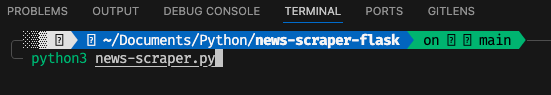
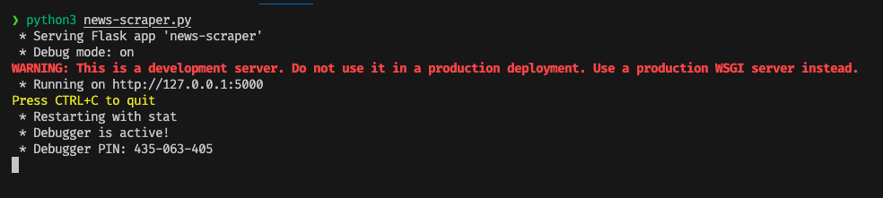
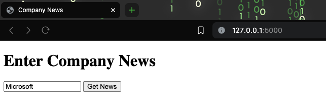
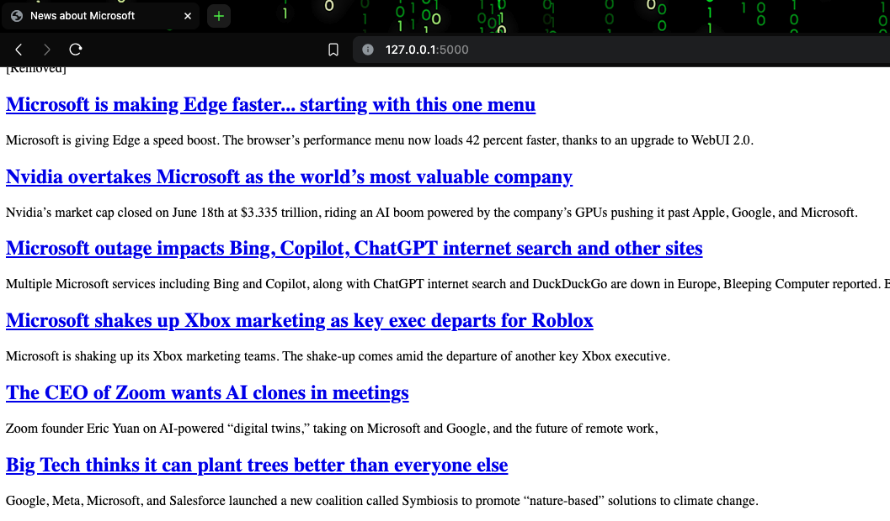

# News Scraper 2.0

## Download the project

## Register API Keys at https://newsapi.org/

## Create a config.py file and create a variable for the API keys

## import the keys into news-scraper.py & install flask & requests by running 'pip install requests flask'

## To run the program in terminal 'python3 news-scraper.py'

--- 

